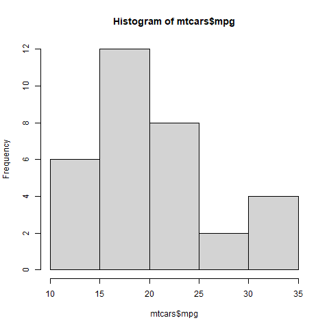

## 14.1 Introduction

A significant part of your role as a data analyst involves communicating results clearly through reports.

Quarto is a powerful reporting tool that integrates seamlessly with RStudio. It allows you to combine:

-   Narrative text
-   R code
-   Tables
-   Visualizations

And render them into multiple output formats including:

-   HTML
-   PDF
-   Word
-   PowerPoint
-   RevealJS slides
-   Dashboards

In this lesson, we will learn how to use Quarto within the RStudio environment.


## 14.2 Learning Objectives

By the end of this lesson, you should be able to:

-   Create and render a Quarto document using R
-   Output documents in HTML, PDF, Word, and PowerPoint formats
-   Understand basic Markdown syntax
-   Use code chunk options to control execution and output
-   Display tables and plots inside Quarto documents


## 14.3 Installing Quarto

1.  Install Quarto from quarto.org.
2.  Verify installation in your terminal:

quarto --version

3.  Install TinyTeX for PDF rendering:

quarto install tinytex

Install required R packages:

``` r
install.packages(c("dplyr", "plotly", "DT"))
```


## 14.4 Creating a New Quarto Document

In RStudio:

File → New File → Quarto Document

Save it as:

first_quarto_doc.qmd

Add:

```{r}
# Section 1

Hello

# Section 2

World
```


Click Render to generate HTML output.


## 14.5 Adding Code Chunks

Code chunks in R:

```{r}
2 + 2
```

```{r}
3 * 3
```

Shortcuts:

-   Ctrl + Enter → Run current line
-   Ctrl + Shift + Enter → Run entire chunk


## 14.6 YAML Header

Example YAML header:

```{r}
---
title: "My First Quarto Document"
author: "Your Name"
format: html
---
```


To embed resources:

format: html: embed-resources: true


## 14.7 Output Formats

Try changing format in YAML:

-   html
-   pdf
-   docx
-   pptx
-   revealjs
-   dashboard

Example:

format: pdf


## 14.8 Markdown Basics

```{r}
### Headers

# Level 1

## Level 2

### Level 3

### Emphasis
```


This is *italic* and this is **bold**.

```{r}
### Lists

-   First item
-   Second item

### Links

[Example Link](https://example.com)
```


## 14.9 Code Chunk Options

Hide code but show output:

```{r echo=FALSE}
x <- 2 + 2
x
```

Global option example:

execute: echo: false


## 14.10 Displaying Tables

Use built-in dataset:

```{r}
head(mtcars)
```

Interactive table (HTML only):

```{r}
library(DT)
datatable(mtcars)
```


## 14.11 Displaying Plots

Histogram using base R:

```{r}
hist(mtcars$mpg)
```

Interactive histogram using Plotly:

```{r}
library(plotly)

plot_ly(
  mtcars,
  x = ~mpg,
  type = "histogram"
)
```


## 14.12 Saving Plots for Static Outputs

```{r}
png("mpg_hist.png")
hist(mtcars$mpg)
dev.off()
```

Include image:




## 14.13 Practice Exercise

1.  Create a Quarto document.
2.  Add:
    -   A title
    -   Two sections
    -   One R code chunk
    -   One histogram using mtcars
3.  Render to HTML.
4.  Change format to PDF and render again.


## 14.14 Wrapping Up

In this lesson, you learned how to:

-   Create Quarto documents in RStudio
-   Use Markdown formatting
-   Add R code chunks
-   Control execution behavior
-   Render to multiple formats
-   Display tables and interactive Plotly graphs

Quarto is a core professional reporting tool for R users.

See you in the next lesson.
