## Slides

The following slides are embedded from the `slides` folder.  
Ensure the directory structure is:

slides/data_viz_types/Slide1.jpeg  
slides/data_viz_types/Slide2.jpeg  
...  
slides/data_viz_types/Slide14.jpeg  

### Slide 1


### Slide 2
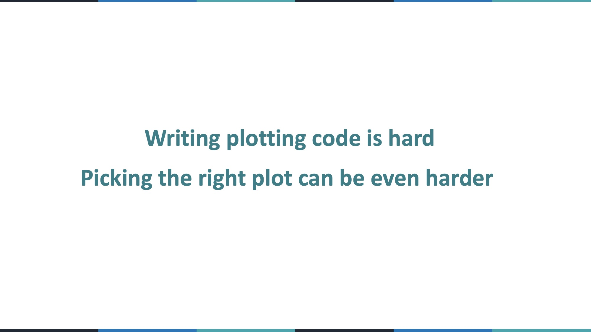

### Slide 3
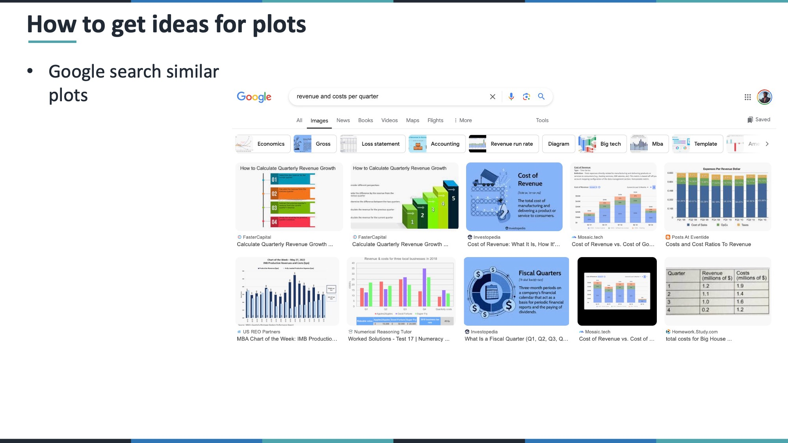

### Slide 4
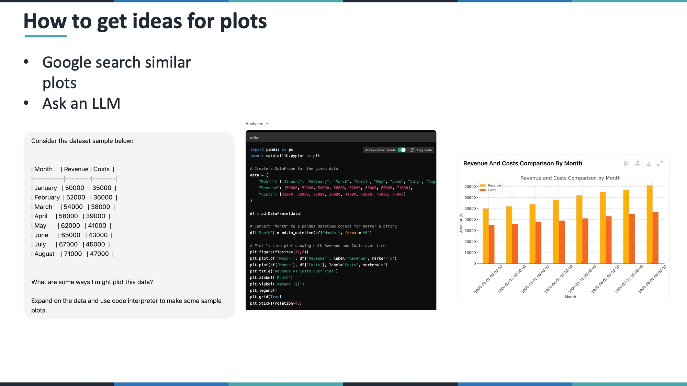

### Slide 5
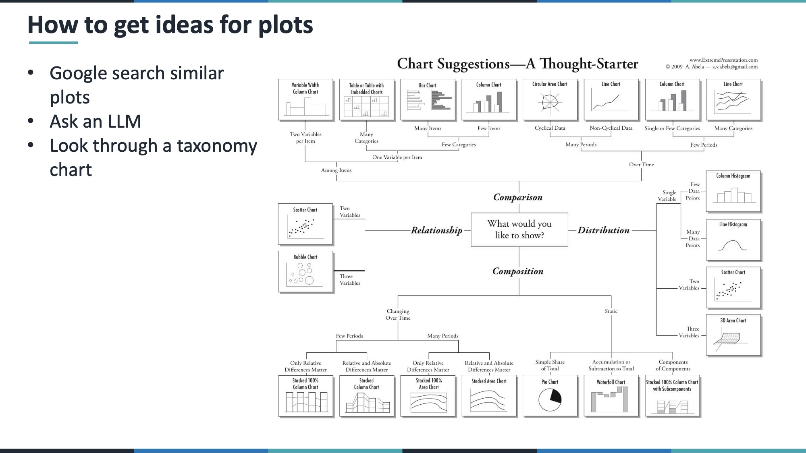

### Slide 6
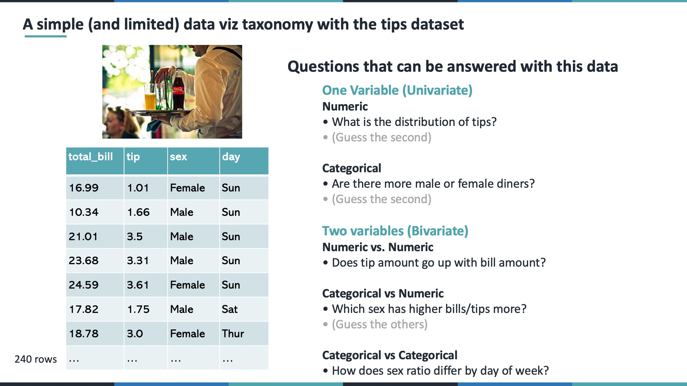

### Slide 7
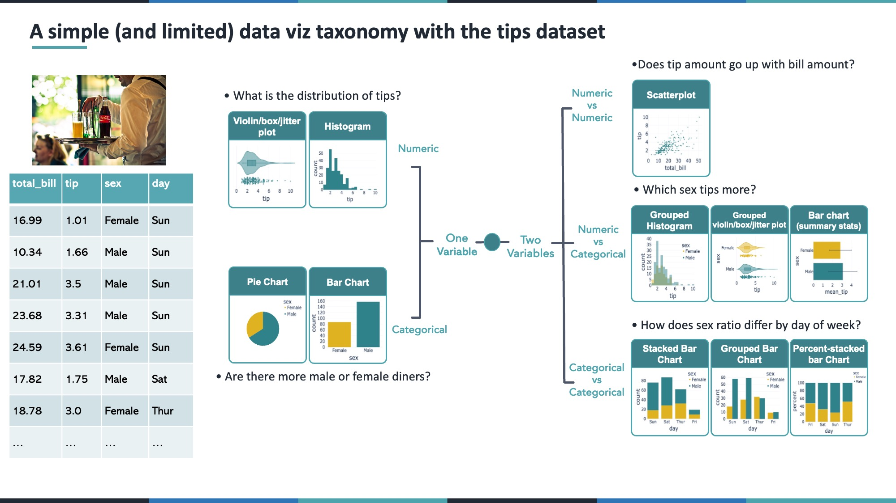

### Slide 8
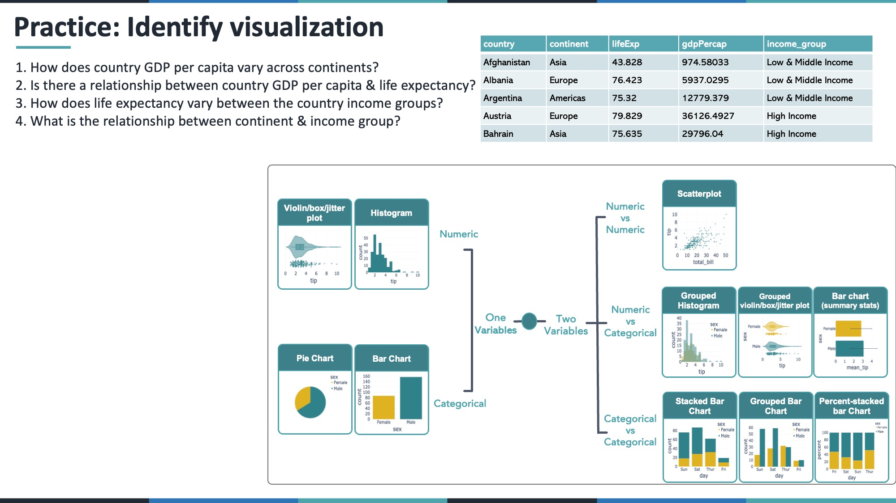

### Slide 9
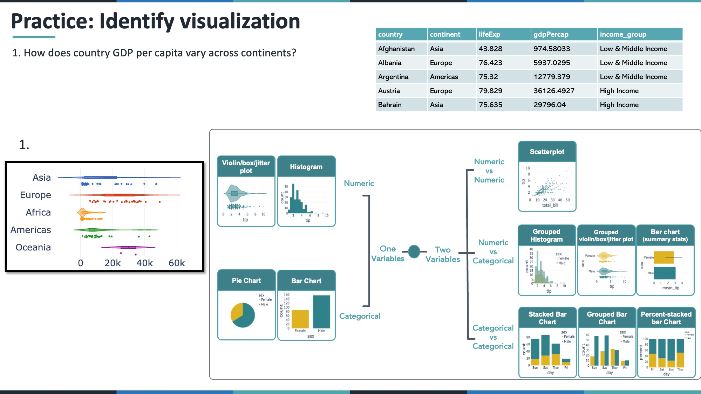

### Slide 10
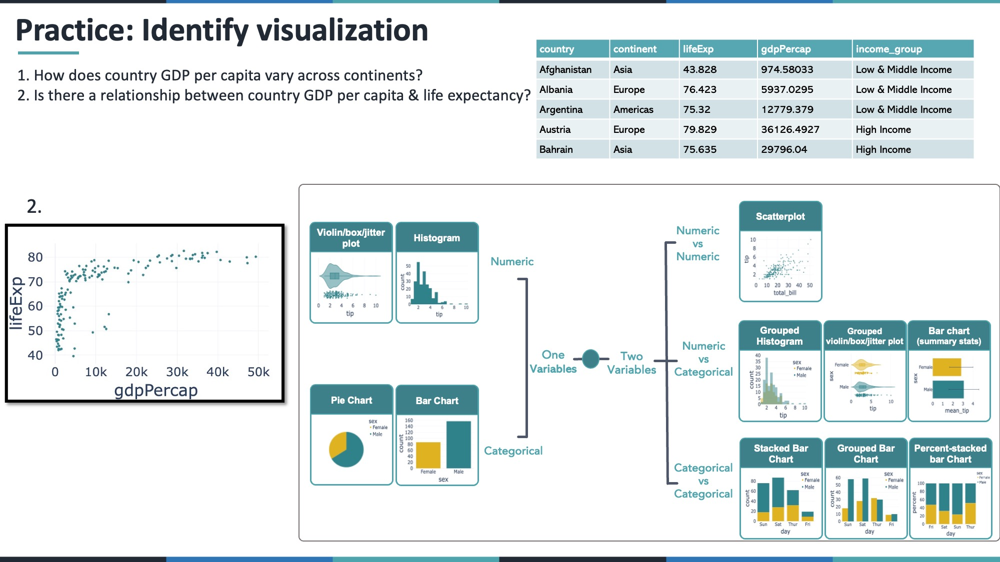

### Slide 11
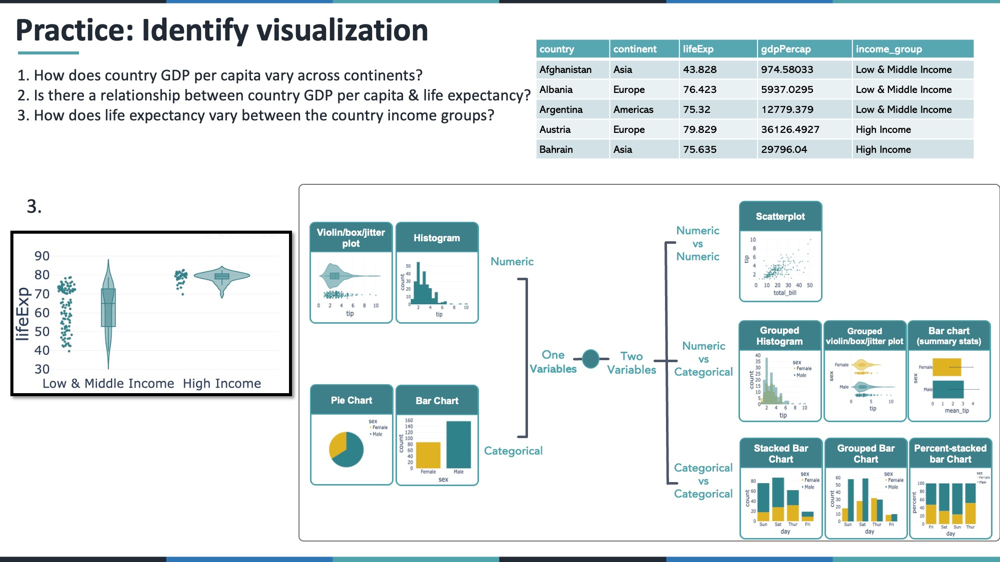

### Slide 12
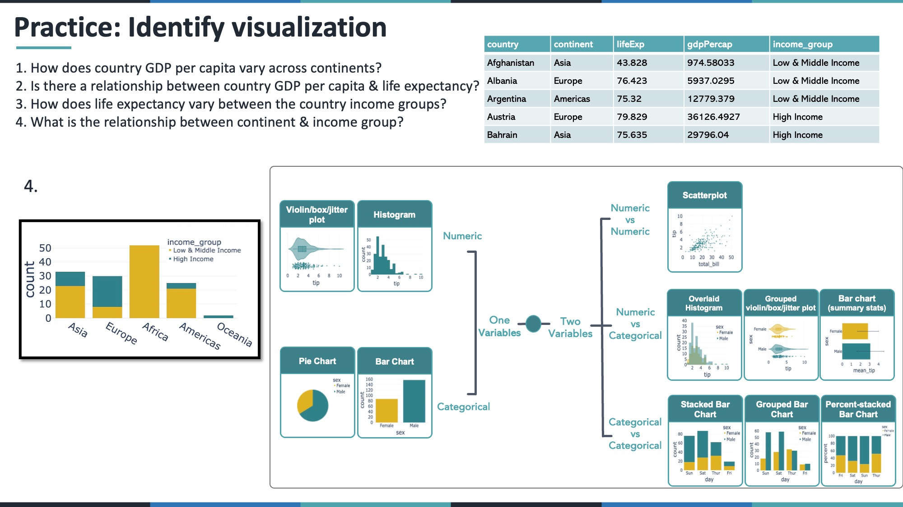

### Slide 13
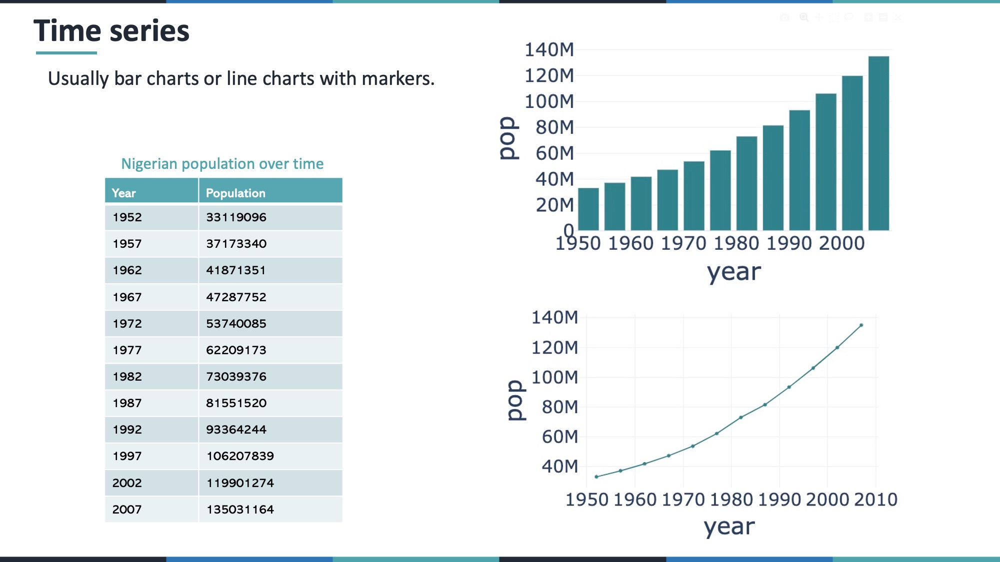

### Slide 14
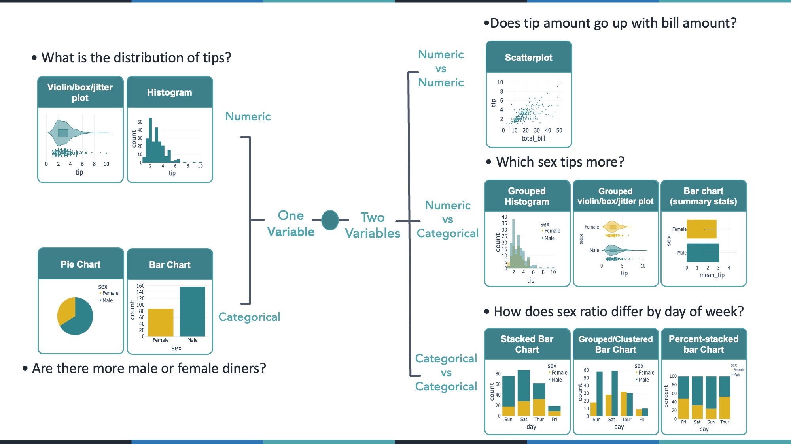

## Introduction

In data visualization, there are typically three core steps:

1. Wrangle and clean your data  
2. Select the appropriate visualization type  
3. Implement the visualization in code  

In this lesson, we focus on choosing the correct visualization type using **Plotly in R** within RStudio.

We will use built-in R datasets such as:

- `mtcars`
- `iris`
- `gapminder` (R package)

---

## Libraries

```{r}
library(plotly)
library(dplyr)
library(gapminder)
```

---

# 1. Univariate Plots

When analyzing a single variable, determine whether it is numeric or categorical.

---

## 1.1 Univariate Numeric

Example: Distribution of Miles Per Gallon (`mpg`) from `mtcars`.

### Histogram

```{r}
plot_ly(mtcars, x = ~mpg, type = "histogram")
```

### Box Plot

```{r}
plot_ly(mtcars, y = ~mpg, type = "box")
```

### Violin Plot

```{r}
plot_ly(mtcars, y = ~mpg, type = "violin",
        box = list(visible = TRUE),
        meanline = list(visible = TRUE))
```

---

## 1.2 Univariate Categorical

Convert cylinders to a categorical variable.

```{r}
mtcars <- mtcars %>% mutate(cyl = factor(cyl))
```

### Bar Chart

```{r}
plot_ly(mtcars, x = ~cyl, type = "histogram")
```

### Pie Chart

```{r}
plot_ly(mtcars, labels = ~cyl, type = "pie")
```

---

# 2. Bivariate Plots

---

## 2.1 Numeric vs Numeric

Question: Does weight relate to fuel efficiency?

```{r}
plot_ly(mtcars,
        x = ~wt,
        y = ~mpg,
        type = "scatter",
        mode = "markers")
```

---

## 2.2 Numeric vs Categorical

Compare MPG across cylinder groups.

### Grouped Histogram

```{r}
plot_ly(mtcars,
        x = ~mpg,
        color = ~cyl,
        type = "histogram")
```

### Box Plot by Category

```{r}
plot_ly(mtcars,
        x = ~cyl,
        y = ~mpg,
        type = "box")
```

---

## 2.3 Categorical vs Categorical

Convert gears to factor.

```{r}
mtcars <- mtcars %>% mutate(gear = factor(gear))
```

### Grouped Bar Chart

```{r}
plot_ly(mtcars,
        x = ~cyl,
        color = ~gear,
        type = "histogram",
        barmode = "group")
```

### Percent Stacked Bar Chart

```{r}
plot_ly(mtcars,
        x = ~cyl,
        color = ~gear,
        type = "histogram") %>%
  layout(barnorm = "percent")
```

---

# 3. Time Series

Using the `gapminder` dataset.

```{r}
nigeria <- gapminder %>% filter(country == "Nigeria")
```

### Line Chart

```{r}
plot_ly(nigeria,
        x = ~year,
        y = ~pop,
        type = "scatter",
        mode = "lines+markers")
```

---

# 4. Multivariate Example

GDP vs Life Expectancy (2007)

```{r}
g_2007 <- gapminder %>% filter(year == 2007)

plot_ly(g_2007,
        x = ~gdpPercap,
        y = ~lifeExp,
        size = ~pop,
        color = ~continent,
        type = "scatter",
        mode = "markers")
```

---

# Practice Section

1. Create a histogram of horsepower (`hp`) in `mtcars`.  
2. Create a box plot of sepal length grouped by species using `iris`.  
3. Create a time series of Ghana’s GDP per capita using `gapminder`.  

```{r}
# Your code here
```

---

# Conclusion

Choosing the correct visualization depends on:

1. Number of variables  
2. Variable type (numeric vs categorical)  
3. Analytical question  

Most analytical storytelling can be accomplished with:

- Histograms  
- Box/Violin plots  
- Scatter plots  
- Bar charts  
- Line charts  

Always begin with the question before selecting the plot type.
